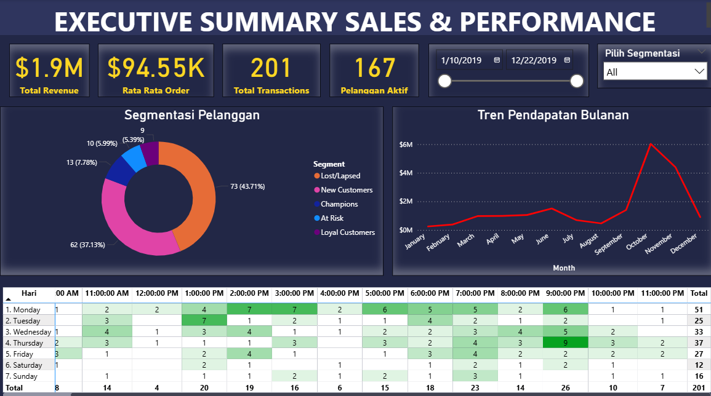

# 📊 Retail Customer Segmentation & Analysis (RFM)

## 📌 Project Overview

Proyek ini bertujuan untuk mengoptimalkan strategi pemasaran sebuah perusahaan ritel dengan melakukan segmentasi pelanggan. Menggunakan data transaksi historis, saya menerapkan metode **RFM (Recency, Frequency, Monetary)** untuk mengelompokkan pelanggan menjadi segmen actionable seperti _Champions_, _Loyal_, dan _At Risk_.

## 📂 Dataset & Tools

- **Dataset:** E-Commerce Transaction Data (2000+ rows).
- **Tools:** Python (Pandas, NumPy), Scikit-Learn, Power BI, Streamlit.

## 🔑 Key Insights

1. **Revenue Driver:** Pendapatan didorong oleh nilai barang mahal (_Rate_), bukan jumlah barang (_Quantity_).
2. **Retention Alert:** 43% Pelanggan masuk kategori _Lost/Lapsed_.
3. **Prime Time:** Transaksi tertinggi terjadi pada hari **Kamis**, terendah pada **Sabtu**.

## 📈 Visuals
[🔗 View Live Dashboard](https://rrfm-customer-segmentation.streamlit.app/)

